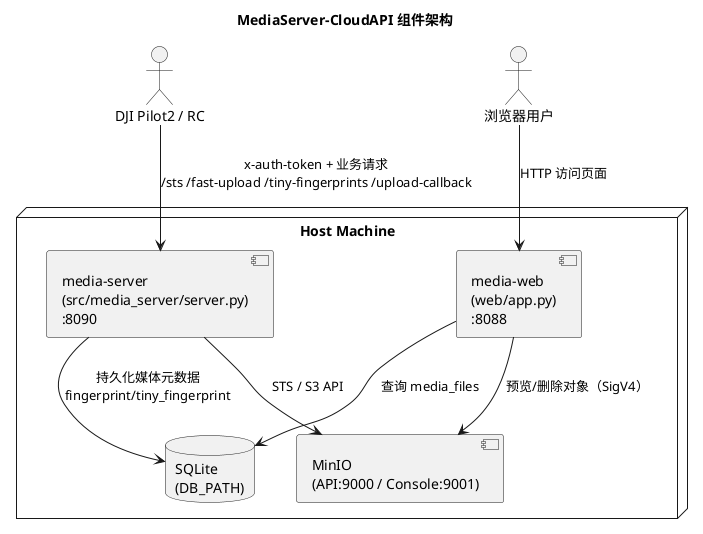
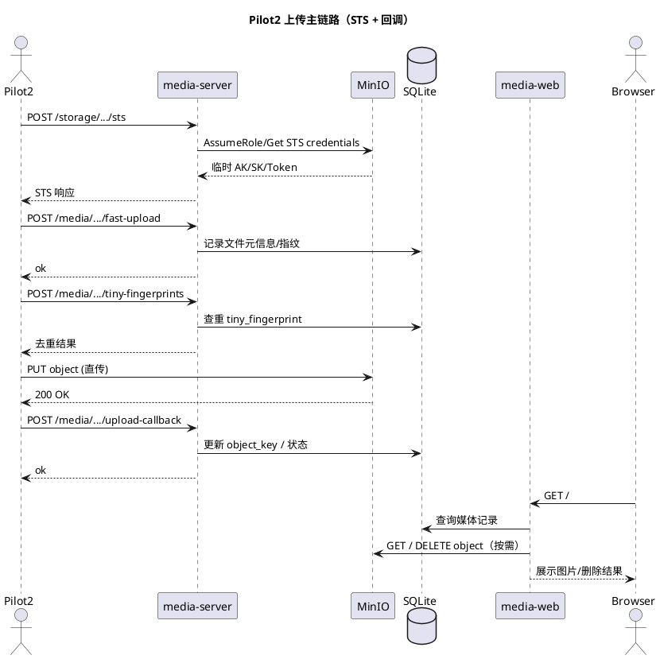

# 媒体管理服务

本目录提供一个可运行的媒体管理服务（Python 标准库实现），配合 MinIO 对象存储即可让 DJI Pilot2 自动上传媒体文件，在DJI Matrice 4E与4T上完成了测试。

## 目录

- [快速开始（推荐）](#快速开始推荐)
- [手动部署（开发/本机）](#手动部署开发本机)
- [Linux 部署（高级）](#linux-部署高级)
- [架构与链路（PlantUML）](#架构与链路plantuml)
- [验证流程](#验证流程)
- [调试指南](#调试指南)
- [目录结构](#目录结构)
- [object_key 规则](#object_key-规则)

## 快速开始（推荐）

适用于 Ubuntu 20/22/24 LTS，一键完成 MinIO、bucket、systemd 服务与开机自启配置。

```bash
bash deploy/setup.sh
```

脚本会：

- 同步项目到 `/opt/mediaserver/MediaServer-CloudAPI`
- 启动 MinIO（Docker Compose）
- 自动创建 `media` bucket
- 默认写入 `STORAGE_ENDPOINT=http://127.0.0.1:9000`（服务端内部访问）
- 启动并启用 `media-server` 与 `media-web` systemd 服务
- 输出执行摘要

如果你在开发机/边缘设备上不想安装 systemd 服务，可以使用“本地一键管理脚本”：

```bash
chmod +x deploy/one_click.sh
./deploy/one_click.sh start
./deploy/one_click.sh check
```

常用命令：

- `./deploy/one_click.sh status` 查看三组件状态（MinIO / media-server / media-web）
- `./deploy/one_click.sh logs` 持续查看服务日志
- `./deploy/one_click.sh stop` 一键停止

## 手动部署（开发/本机）

### 依赖

- Python 3.8+
- Docker（启动 MinIO）
- SQLite（内置，无需额外安装）

### 端口说明

- 媒体服务：`8090`
- MinIO API：`9000`
- MinIO Console：`9001`

### 1) 启动 MinIO（Docker）

```bash
docker rm -f fc-minio 2>/dev/null || true

docker run -d --name fc-minio --restart unless-stopped \
  -p 9000:9000 -p 9001:9001 \
  -e MINIO_ROOT_USER=minioadmin \
  -e MINIO_ROOT_PASSWORD=minioadmin \
  minio/minio server /data --console-address ":9001"
```

打开 MinIO 控制台：`http://<你的电脑IP>:9001`（账号/密码：`minioadmin` / `minioadmin`）。

### 2) 创建 bucket

使用 MinIO 客户端创建 `media` 桶：

```bash
mkdir -p /tmp/mc

docker run --rm -v /tmp/mc:/root/.mc minio/mc \
alias set local http://127.0.0.1:9000 minioadmin minioadmin

docker run --rm -v /tmp/mc:/root/.mc minio/mc mb local/media
```

说明：macOS 上用 `host.docker.internal` 也可以访问宿主机端口。

### 3) 启动媒体管理服务

`storage-endpoint` 只用于服务端访问 MinIO，推荐固定本机 `127.0.0.1`。
返回给 RC 的上传 endpoint 会按请求头自动推导（默认来自 `Host`，可选信任 `X-Forwarded-*`）：

```bash
python3 src/media_server/server.py \
  --host 0.0.0.0 --port 8090 --token demo-token \
  --storage-endpoint http://127.0.0.1:9000 \
  --storage-bucket media \
  --storage-region us-east-1 \
  --storage-access-key minioadmin \
  --storage-secret-key minioadmin \
  --storage-public-port 9000 \
  --trust-forwarded-headers false \
  --storage-sts-role-arn arn:aws:iam::minio:role/dji-pilot \
  --db-path /opt/mediaserver/data/media.db \
  --log-level info
```

精简指令（默认自动适配 IP）：

```bash
python3 src/media_server/server.py \
  --storage-endpoint http://127.0.0.1:9000
```

参数说明：

- `storage-endpoint` 是服务端访问 MinIO 的内部地址，推荐 `http://127.0.0.1:9000`
- `storage-public-endpoint` 可选，显式固定 STS 返回地址（例如 `http://192.168.10.228:9000`）
- `storage-public-port` 当 `Host` 里未带端口时，STS 返回用这个端口（默认 `9000`）
- `trust-forwarded-headers` 是否信任 `X-Forwarded-Host/Proto`（默认 `false`）
- `storage-access-key/secret-key` 与 MinIO 启动参数一致
- `storage-provider` 默认 `minio`（对应 DJI 的 OssTypeEnum）
- `storage-sts-role-arn` 为 STS 颁发临时凭证使用的 RoleArn（MinIO 不强校验，可保持默认）
- `storage-sts-policy` 可选，JSON 字符串（用于限制临时凭证权限）
- `storage-sts-duration` 临时凭证有效期（秒）
- `db-path` SQLite 数据库文件路径（用于持久化 fingerprint / tiny_fingerprint）
- `log-level` 日志级别（debug/info/warning/error/critical），默认 `info`

### 4) RC WebView 配置

1) 媒体管理地址：`<你的电脑IP>:8090`  
2) Token：与服务端一致（默认 `demo-token`）  
3) 确保 RC 与电脑在同一局域网

### 5) Web 浏览器（Flask）

提供一个基础 Web 页面，实时读取 SQLite 并通过 MinIO 预览图片，支持删除（同时删除 DB 与对象存储）。

依赖安装（推荐与部署保持一致）：

```bash
uv sync
```

启动（在 MinIO + `server.py` 启动后执行）：

```bash
.venv/bin/python web/app.py \
  --db-path /opt/mediaserver/data/media.db \
  --storage-endpoint http://127.0.0.1:9000 \
  --storage-bucket media \
  --storage-region us-east-1 \
  --storage-access-key minioadmin \
  --storage-secret-key minioadmin
```

精简指令：

```bash
.venv/bin/python web/app.py \
  --storage-endpoint http://127.0.0.1:9000
```

访问：`http://<你的电脑IP>:8088`

## Linux 部署（高级）

以下方案提供三件事：

1) MinIO 使用 Docker Compose 常驻
2) `server.py` 使用 systemd 开机自启
3) Web 浏览器使用 systemd 开机自启（可选）

推荐直接运行 `deploy/setup.sh`。脚本会检测 `python3`、自动安装或复用 `uv`、执行 `uv sync --frozen`，并让 systemd service 固定使用项目的 `.venv/bin/python`。

如果不使用 `deploy/setup.sh`，可手动执行如下步骤：

### 1) MinIO（Docker Compose）

```bash
sudo mkdir -p /opt/mediaserver/MediaServer-CloudAPI
sudo chown -R $USER:$USER /opt/mediaserver

cd /opt/mediaserver/MediaServer-CloudAPI/deploy
docker compose up -d
```

### 2) Python 运行环境

```bash
cd /opt/mediaserver/MediaServer-CloudAPI

# 首次部署如未安装 uv
curl -LsSf https://astral.sh/uv/install.sh | sh

~/.local/bin/uv sync --frozen
```

完成后确认：

```bash
/opt/mediaserver/MediaServer-CloudAPI/.venv/bin/python -c "import flask, typer"
```

### 3) 配置环境变量

```bash
sudo nano /opt/mediaserver/MediaServer-CloudAPI/deploy/media-server.env
```

确认以下字段：

- `STORAGE_ENDPOINT` 固定本机 MinIO 地址（推荐 `http://127.0.0.1:9000`）
- `STORAGE_PUBLIC_ENDPOINT` 可选，固定 RC 上传地址；为空则自动按请求头推导
- `STORAGE_PUBLIC_PORT` 默认 `9000`
- `TRUST_FORWARDED_HEADERS` 默认 `false`（仅反向代理时设为 `true`）
- `DB_PATH` 默认使用 `/opt/mediaserver/data/media.db`
- `MEDIA_SERVER_TOKEN` 与 Pilot2 配置一致

### 4) systemd 服务

```bash
sudo cp /opt/mediaserver/MediaServer-CloudAPI/deploy/media-server.service /etc/systemd/system/
sudo cp /opt/mediaserver/MediaServer-CloudAPI/deploy/media-web.service /etc/systemd/system/

sudo systemctl daemon-reload
sudo systemctl enable media-server.service
sudo systemctl start media-server.service

# 可选：Web 浏览器
sudo systemctl enable media-web.service
sudo systemctl start media-web.service
```

查看日志：

```bash
sudo journalctl -u media-server.service -f
sudo journalctl -u media-web.service -f
```

## 架构与链路（PlantUML）

### 1) 组件架构图



### 2) 上传主链路时序图



## 验证流程

### 1) 服务健康检查

```bash
curl -s http://127.0.0.1:8090/health
```

应返回：

```
{"code":0,"message":"ok","data":{}}
```

### 2) 服务连通性

在 RC 上点击“状态检查”，日志显示：

```
[Media模块] 服务可达: http://<你的电脑IP>:8090 (200)
[存储] 服务可达: http://<你的电脑IP>:9000 (200)
```

换网后只需要让 RC 访问新的媒体服务地址（`http://<新IP>:8090`），
通常不需要修改 `media-server.env` 里的 MinIO 地址。

### 3) Pilot2 自动上传

在 Pilot2 上拍一张新照片，服务端日志应出现：

- `fast-upload`
- `tiny-fingerprints`
- `sts`
- `upload-callback`

### 4) STS + 上传自测脚本

先跑自测脚本，确认 STS 与 MinIO 直传链路可用：

```bash
python3 src/media_server/scripts/test_sts_upload.py \
  --media-host http://127.0.0.1:8090 \
  --workspace-id <你的workspace_id> \
  --token demo-token
```

脚本会执行 PUT/HEAD/DELETE。删除是预期行为，因此 MinIO 控制台里可能看不到对象。

### 5) STS endpoint 自动适配检查

```bash
curl -s -X POST \
  -H "x-auth-token: demo-token" \
  -H "Content-Type: application/json" \
  -d '{}' \
  http://127.0.0.1:8090/storage/api/v1/workspaces/<你的workspace_id>/sts | jq '.data.endpoint'
```

如果你要模拟 RC 从某个 Host 访问：

```bash
curl -s -X POST \
  -H "Host: 192.168.10.228:8090" \
  -H "x-auth-token: demo-token" \
  -H "Content-Type: application/json" \
  -d '{}' \
  http://127.0.0.1:8090/storage/api/v1/workspaces/<你的workspace_id>/sts | jq '.data.endpoint'
```

## 调试指南

### 查看媒体服务日志

直接看 `server.py` 输出即可，常见关键字：

- `sts`：Pilot2 成功拿到临时凭证
- `fast-upload`：Pilot2 上报文件元信息
- `tiny-fingerprints`：Pilot2 查重
- `upload-callback`：上传完成回调

### 实时查看 MinIO 请求（强烈推荐）

MinIO 默认日志不会输出每条请求，使用 `mc admin trace`：

```bash
docker run --rm -v /tmp/mc:/root/.mc minio/mc \
  alias set local http://127.0.0.1:9000 minioadmin minioadmin

docker run --rm -v /tmp/mc:/root/.mc minio/mc \
  admin trace local --all
```

执行自测脚本或 Pilot2 上传时，你会看到 PUT/HEAD/DELETE。

### 查看桶内容

```bash
docker run --rm -v /tmp/mc:/root/.mc minio/mc ls local/media
```

### 精简 trace 输出（只看 S3 相关）

```bash
docker run --rm -v /tmp/mc:/root/.mc minio/mc \
  admin trace local --all 2>&1 | rg 's3\.(PutObject|HeadObject|DeleteObject|GetObject)'
```

### 常见问题

- 只有 `sts`：凭证已发放，但 Pilot2 未上传（可能未触发拍照、网络不可达或 STS 签名无效）
- 没有 `upload-callback`：上传未完成或上传失败
- MinIO Console 看不到对象：自测脚本会 DELETE（正常）
- RC 连不上：检查防火墙是否阻止 `8090/9000` 端口
- 换网后上传失败：先确认 RC 访问的是新 `http://<新IP>:8090`，再检查 STS 返回 endpoint 是否跟随变更
- 反向代理场景：设置 `TRUST_FORWARDED_HEADERS=true` 并确保代理透传 `X-Forwarded-Host/Proto`
- 需要固定地址回退：设置 `STORAGE_PUBLIC_ENDPOINT=http://x.x.x.x:9000` 并重启 `media-server.service`
- 指纹持久化位置：默认 `/opt/mediaserver/data/media.db`（`media_files` 同时存 fingerprint 与 tiny_fingerprint）

## 目录结构

- `src/media_server/server.py` 服务入口（保持原用法）
- `src/media_server/app.py` 服务启动与配置加载
- `src/media_server/handler.py` 路由分发与基础请求处理
- `src/media_server/handlers/` 各接口处理逻辑
- `src/media_server/http_layer/` 请求解析/错误码/路由
- `src/media_server/storage/` 存储层（STS/S3/DB/签名）
- `src/media_server/utils/` 通用工具（HTTP 响应/安全清理/签名）
- `src/media_server/config/` 配置对象与参数解析
- `src/media_server/scripts/test_sts_upload.py` STS + MinIO 直传自测脚本
- `src/media_server/scripts/image_gen.py` 生成随机 PNG 测试图
- `doc/flow.md` 执行流程与架构图
- `doc/overview.md` 面向 AI/开发者的快速说明

## object_key 规则

服务端生成：

```
media/{workspace_id}/{YYYYMMDD}/{filename}
```

文件名中的 `/` 会替换为 `_`。
