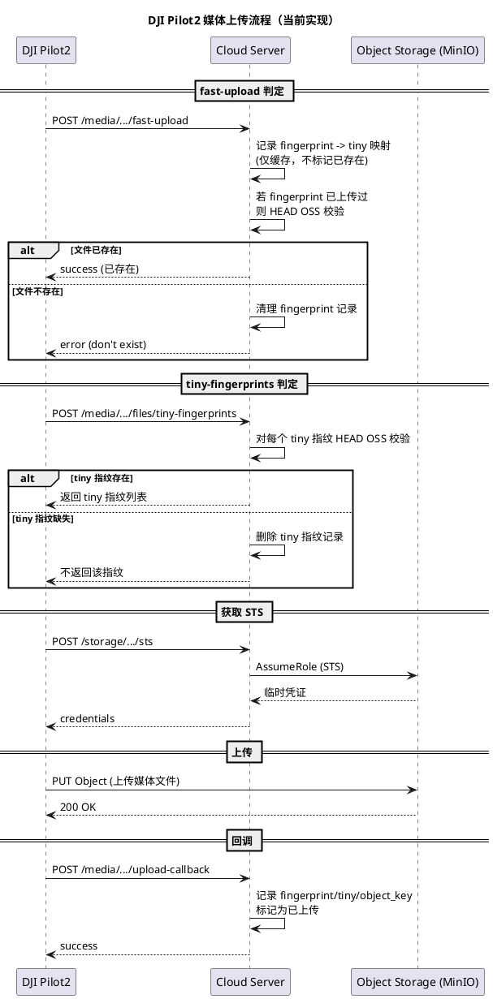
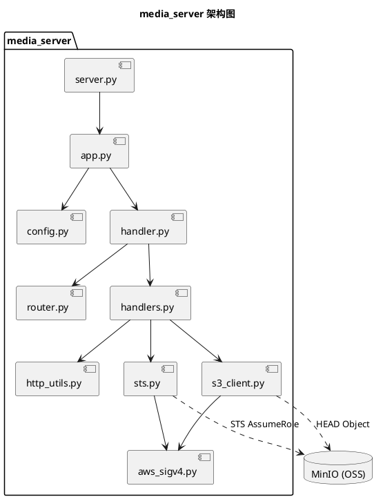

# 媒体服务执行流程说明

本文档描述 `media_server` 的整体执行逻辑、关键状态与上传链路，便于理解 Pilot2 与对象存储的交互方式。

## 核心组件

- `src/media_server/server.py`：入口，负责启动服务
- `src/media_server/app.py`：解析配置并初始化 HTTPServer
- `src/media_server/handler.py`：路由分发与基础请求处理
- `src/media_server/handlers.py`：业务逻辑（fast-upload / tiny-fingerprints / sts / upload-callback）
- `src/media_server/sts.py` + `src/media_server/aws_sigv4.py`：向 MinIO STS 获取临时凭证
- `src/media_server/s3_client.py`：HEAD 校验对象是否真实存在

## 服务内存状态

- `uploaded_fingerprints`：已确认上传成功的 fingerprint 集合
- `tiny_fingerprint_index`：已确认上传成功的 tiny 指纹集合
- `pending_tiny_by_fingerprint`：fast-upload 收到的 fingerprint → tiny 指纹映射（尚未确认上传）
- `object_key_by_fingerprint`：fingerprint → object_key
- `object_key_by_tiny`：tiny 指纹 → object_key

这些状态只存在于内存中，服务重启会清空。

## 关键逻辑规则

1) **fast-upload**  
   - 先判断 fingerprint 是否已记录为上传成功  
   - 若已记录，会对 MinIO 执行 HEAD 校验  
   - HEAD 成功 → 返回 success（表示已存在）  
   - HEAD 失败 → 删除指纹记录并返回 “don’t exist”  

2) **tiny-fingerprints**  
   - 对每个 tiny 指纹执行 HEAD 校验  
   - HEAD 成功 → 返回该 tiny 指纹  
   - HEAD 失败 → 从内存索引删除该 tiny 指纹  

3) **sts**  
   - 向 MinIO STS 请求临时凭证  
   - 返回 `credentials` 给 Pilot2  

4) **upload-callback**  
   - 仅在文件真实上传成功后触发  
   - 写入 fingerprint/tiny 指纹索引与 object_key 映射  

## 执行流程（PlantUML）

## 架构图（PlantUML）

## 常见现象

- 只有 fast-upload / tiny-fingerprints：说明上传未触发或被判定为已存在
- 没有 upload-callback：上传没完成或 OSS 不可达
- MinIO 没有 PUT：检查 fast-upload 是否误返回 success
