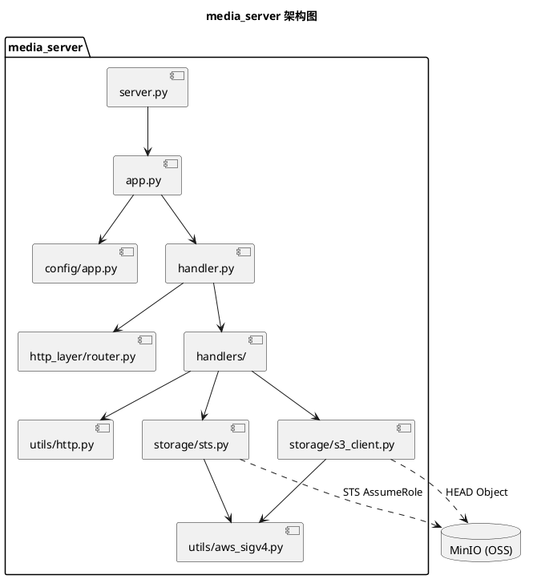

# 媒体服务执行流程说明

本文档描述 `media_server` 的整体执行逻辑、关键状态与上传链路，便于理解 Pilot2 与对象存储的交互方式。

## 验证提示

- 结构/解析自检：`python3 src/media_server/scripts/test_refactor_smoke.py`
- 端到端自测：`python3 src/media_server/scripts/test_sts_upload.py --media-host http://127.0.0.1:8090 --workspace-id <id> --token demo-token`

## 核心组件

- `src/media_server/server.py`：入口，负责启动服务
- `src/media_server/app.py`：解析配置并初始化 HTTPServer
- `src/media_server/handler.py`：路由分发与基础请求处理
- `src/media_server/handlers/`：业务逻辑（fast-upload / tiny-fingerprints / sts / upload-callback）
- `src/media_server/storage/sts.py` + `src/media_server/utils/aws_sigv4.py`：向 MinIO STS 获取临时凭证
- `src/media_server/storage/s3_client.py`：HEAD 校验对象是否真实存在

## 服务持久化状态

SQLite 表 `media_files`：

- `fingerprint` 与 `tiny_fingerprint` 的关联
- `fingerprint/tiny_fingerprint` 与 `object_key` 的关联

该表是单一真相来源，服务重启不丢失。

## 关键逻辑规则

1) **fast-upload**  
   - 先判断 fingerprint 是否已有 object_key 记录  
   - 若已记录，会对 MinIO 执行 HEAD 校验  
   - HEAD 成功 → 返回 success（表示已存在）  
   - HEAD 失败 → 删除指纹记录并返回 “don’t exist”  

2) **tiny-fingerprints**  
   - 对每个 tiny 指纹执行 HEAD 校验  
   - HEAD 成功 → 返回该 tiny 指纹  
   - HEAD 失败 → 从数据库删除该 tiny 指纹记录  

3) **sts**  
   - 向 MinIO STS 请求临时凭证  
   - 返回 `credentials` 给 Pilot2  

4) **upload-callback**  
   - 仅在文件真实上传成功后触发  
   - 写入 fingerprint/tiny 与 object_key 映射  

## 执行流程（PlantUML）

## 架构图（PlantUML）

## 常见现象

- 只有 fast-upload / tiny-fingerprints：说明上传未触发或被判定为已存在
- 没有 upload-callback：上传没完成或 OSS 不可达
- MinIO 没有 PUT：检查 fast-upload 是否误返回 success
